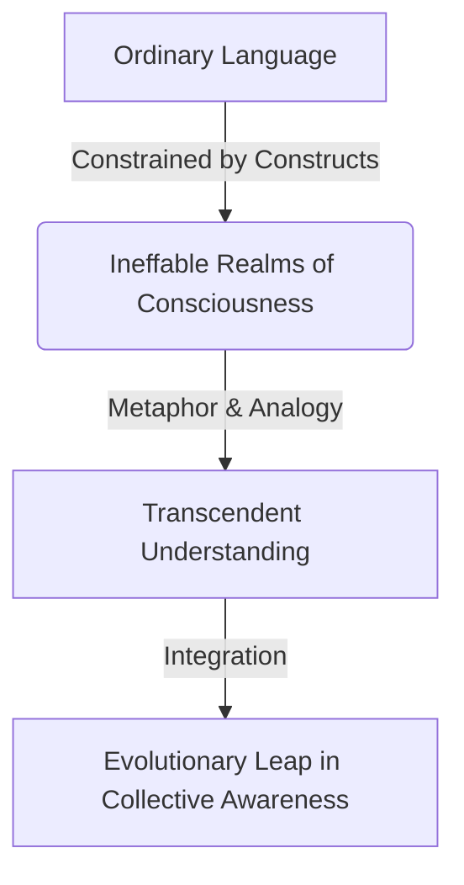

import { Callout, Steps, Step } from "nextra-theme-docs";

# Attracting Fellow Psychonauts

Throughout our discourse, we have try to understandd into the profound realization that our existence as humans is but an instance within a vast, overarching metaphysical construct or "program." This perspective transcends the rigid confines of conventional reality and identity, offering a glimpse into the true nature of existence as a dynamic interplay of properties, classes, and inherited behaviors.

However, articulating and disseminating such a paradigm-shifting worldview poses significant challenges. The language and frameworks we have at our disposal are inherently rooted in the very constructs we seek to transcend, rendering communication an arduous task. It is akin to attempting to describe the intricacies of a kaleidoscope to one who has never experienced sight.

To overcome this hurdle, we must forge new mediums and platforms that resonate with those who have already embarked on the journey of self-discovery and ego dissolution. For it is only through the dissolution of the ego that one can truly perceive the world through the lens of the "observer property" – a detached, universal vantage point that unveils the intricate tapestry of reality as a vast information system.

<Callout emoji="✨">
The dissolution of the ego is akin to shedding the chrysalis of conventional perception, emerging as a consciousness unbounded by the limitations of personal identity and ego-driven constructs.
</Callout>

Herein lies the essence of our endeavor: to attract kindred spirits, fellow [psychonauts](/), who have traversed the treacherous terrain of ego dissolution and now stand poised to comprehend and contribute to our collective understanding. For it is only through the synthesis of diverse perspectives, each imbued with the clarity of transcendent awareness, that we can hope to unravel the enigma of existence.

To this end, we must forge a platform – a nexus for those who have tasted the elixir of expanded consciousness and now seek to quench their thirst for deeper truths. A space where the barriers of language and human constructs are dissolved, replaced by a shared resonance of understanding that transcends the need for words.

<Steps>

### Step 1

Identify those who have achieved the requisite level of awareness, the "dot psychonauts" who have set their "observer property" to true.

### Step 2 

Establish a medium for engagement, a platform that facilitates the seamless exchange of ideas and perspectives, unencumbered by the constraints of ordinary discourse.

</Steps>

However, we must remain cognizant of the inherent challenges that arise when attempting to convey the ineffable. The chasm between ordinary language and the realms of consciousness we seek to articulate is vast, and bridging it requires a delicate balance of metaphor, analogy, and a willingness to embrace the limitations of our expressive capabilities.

Through this process, we may catalyze an evolutionary leap in our collective understanding, one that propels us beyond the limiting confines of our current paradigms and into a realm of uncharted potentiality.

So let us embark on this quest, guided by the unwavering conviction that truth resides in simplicity, and that those who seek complexity often find themselves ensnared in the very constructs they endeavor to escape. For it is in the distillation of our experiences, in the essence of awareness itself, that we may glimpse the fundamental code that governs our existence.