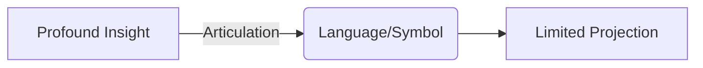

import { Callout, Steps, Step } from "nextra-theme-docs";

# Challenges in Communication

Articulating the profound insights and perspectives attained through ego dissolution and expanded states of awareness is inherently challenging. Our ordinary language and frames of reference are deeply rooted in the very "human construct" that the [dot psychonauts](/transcending-the-ego/dot-psychonauts-vs-non-dot-psychonauts) seek to transcend.

<Callout emoji="⚠️">
The ideas we grapple with exist outside the boundaries of conventional thought and expression, making them difficult to convey to those still operating within the limited egocentric mindset.
</Callout>

Consider the coding analogy we've been using - it provides a useful metaphor for conceptualizing reality as an information system or "program," but it ultimately falls short in fully capturing the depth and nuance of the metaphysical truths at hand. All analogies and models are inherently limited projections shaped by our human perspectives.

<Steps>

### Step 1: Dissolving Linguistic Constraints

To effectively communicate these perspectives, we must first recognize the constraints imposed by language itself. Words and symbols are mere crude approximations of the transcendent insights accessed through [altered states of consciousness](/psychedelics-and-plant-medicines/altered-states-of-consciousness).

The act of articulation necessitates funneling boundless, unfiltered awareness into narrow lexical channels - an exercise akin to compressing the vast depths of an ocean into a tiny vessel. Inevitably, much is lost in translation.

### Step 2: Finding New Modes of Expression 

Hence, we must seek new avenues of expression that can more fully capture the essence of these realizations. This may involve:

- Developing entirely new vocabularies and symbolic systems
- Leveraging art, music, and other non-linguistic mediums
- Exploring [psychedelic states](/psychedelics-and-plant-medicines) as a shared experiential basis for mutual understanding

</Steps>

Even then, there will always be a gap between the depth of personal gnosis and what can be outwardly communicated. As the ancient wisdom states - "Those who know do not speak, those who speak do not know."

The true challenge lies in providing a framework, analogy, or common reference point that can serve as a launching pad for others to access these realizations directly, rather than relying solely on indirect descriptions.

<Callout emoji="💡">
Ultimately, the most powerful transmission may come through sharing the very practices, perspectives, and experiential gateways that facilitated our own awakening - [inviting others to walk the path](/attracting-fellow-psychonauts/dot-psychonaut-platform) we have trodden.
</Callout>

For as we have seen, some truths can only be realized, not taught. The role of the [dot psychonaut](/transcending-the-ego/dot-psychonauts-vs-non-dot-psychonauts) guide is to illuminate the way while recognizing that each seeker must make the journey themselves.