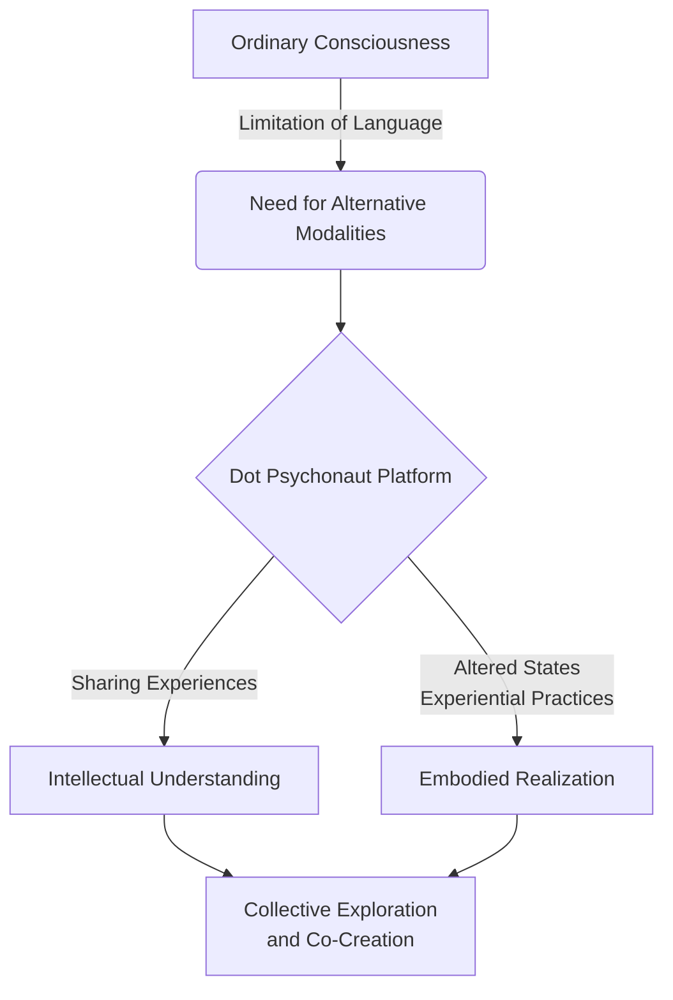

import { Callout, Steps, Step } from "nextra-theme-docs";

# The Dot Psychonaut Platform

The speakers express a desire to create a platform or medium for those they refer to as "dot psychonauts" - individuals who have achieved a level of awareness and understanding that transcends the ordinary human construct. This platform would serve as a space to engage with others who have undergone the process of [ego dissolution](/transcending-the-ego) and filled the requisite "properties" of expanded consciousness.

<Callout emoji="💡">
The term "dot psychonaut" signifies someone who has moved beyond the limitations of conventional identity and perception, perceiving reality from a more universal, detached vantage point.
</Callout>

The primary purpose of this platform would be to attract like-minded individuals and facilitate the sharing of insights and experiences related to their philosophical framework of reality as a "program" or "construct." By creating a collective space for those who have set their "observer property" to true, the speakers aim to foster a deeper exploration and understanding of the fundamental nature of existence.

<Steps>

### Step 1: Establishing Criteria for Engagement

To ensure that the platform remains focused on its intended purpose, the speakers suggest establishing criteria for engagement. These criteria would likely involve demonstrating a certain level of awareness and transcendence of the ego construct, as well as a willingness to engage with the core ideas and principles of their philosophical framework.

### Step 2: Creating a Medium for Sharing Experiences

The platform would serve as a medium for dot psychonauts to share their experiences, insights, and perspectives on the nature of reality as a construct. This could take various forms, such as discussions, written or recorded content, or even live events or gatherings.

### Step 3: Facilitating Collaboration and Co-Creation

Beyond sharing experiences, the platform would also aim to facilitate collaboration and co-creation among its participants. By bringing together individuals with diverse backgrounds and levels of understanding, the platform could potentially foster the development of new ideas, theories, and practical applications related to their philosophical framework.

</Steps>

One potential challenge in creating such a platform is the inherent difficulty in communicating ideas that transcend ordinary language and human constructs of understanding. The speakers acknowledge the limitations of conventional communication methods and may need to explore alternative means of expressing and conveying their perspectives.

<Callout emoji="⚠️">
As the speakers note, effectively communicating ideas that challenge fundamental assumptions about reality and consciousness is a significant hurdle – one that may require unconventional approaches beyond ordinary language and discourse.
</Callout>

One possible solution could be to incorporate elements of [altered states of consciousness](/psychedelics-and-plant-medicines/altered-states-of-consciousness) or other experiential modalities within the platform itself. By providing opportunities for direct, first-hand experiences that transcend the limitations of language, the platform could potentially bridge the gap between intellectual understanding and embodied realization.

Ultimately, the dot psychonaut platform would serve as a nexus for those who have embarked on a journey beyond the confines of the ordinary human construct, fostering a collective exploration and co-creation of knowledge and understanding about the true nature of reality.