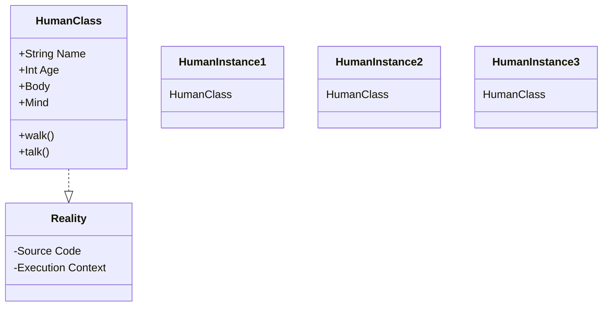

import { Callout, Steps, Step } from "nextra-theme-docs";

# Humans as a Class in the Reality Program

According to the psychonaut perspective, humans can be viewed as instances or objects of a "class" within the larger metaphysical system or "program" that governs reality. This idea draws a parallel between our existence and the way objects are instantiated from class definitions in object-oriented programming.

In this framework, the "human class" would define the essential properties, attributes, and behaviors that all human beings inherit by virtue of our existence within this reality construct. Just as a `Person` class in code might have properties like `name`, `age`, and methods like `walk()` and `talk()`, the "human class" dictates the fundamental aspects of our being - our physical form, cognitive capacities, and core experiences that shape the human condition.

<Callout emoji="💡">
The key insight here is that our perceived reality, with all its richness and complexity, could be an emergent phenomenon arising from the execution of this underlying "source code" or system, much like a software program produces its output and functionality through the execution of its code base.
</Callout>

This perspective invites us to transcend the conventional, egocentric view of reality and instead perceive ourselves as part of a vast, overarching metaphysical architecture - akin to the way individual object instances are part of a larger application or system in software. While we may feel a strong sense of individuality and personal identity, the psychonaut view suggests that at a deeper level, we are all instantiations of this primordial "human class," much like objects are instantiations of their respective classes.

<Steps>

### Step 1: Grasping the "Human Class" Concept
To fully grasp this perspective, try to conceptualize your own existence as an instantiation or manifestation of the "human class" definition. Consider your physical body, cognitive capacities, emotional experiences, and fundamental attributes as "properties" inherited from this class, just as an object inherits properties from its class in code.

### Step 2: Exploring the Implications
Once you can view yourself through this lens, explore the implications of being part of a larger system or "program." How does this shift your perspective on the nature of reality, consciousness, and your place within the grand scheme of existence? Does it hint at deeper truths or mysteries underlying the facade of ordinary human experience?

</Steps>

Mermaid diagrams can provide a helpful visualization of this concept:

In the above diagram, we see the `HumanClass` as a component within the overarching `Reality` system, with individual `HumanInstance` objects being instantiations of that class. This symbolic representation highlights how the psychonaut perspective frames human existence as part of a broader metaphysical architecture or "program."

<Callout emoji="💬">
As you explore this section, keep in mind the core premise: our conventional sense of self and reality may be a limited, egocentric view confined within the "human construct." To grasp the bigger picture, we must strive to perceive ourselves as small but integral parts of a vast, intelligent system that transcends our ordinary modes of understanding.
</Callout>

While this perspective may seem esoteric or counterintuitive at first, the psychonauts argue that it provides a more accurate and expansive model for making sense of our existence - one that doesn't get bogged down in the reductionist traps of conventional materialism or religious dogma. By adopting the mindset of reality as an information system or metaphysical "program," we open ourselves to new frontiers of understanding and awaken to the wonders that may lie beyond the limits of ordinary human consciousness.

For a deeper exploration of the key concepts mentioned here, you can refer to the following sections:

- [Properties and Filling Properties](/humans-as-a-class/properties-and-filling-properties)
- [Inheritance and Subclasses](/humans-as-a-class/inheritance-and-subclasses)

These subsections will try to understand into the nuances of "properties" that define the human experience, as well as the idea of the "human class" potentially inheriting from even higher-level abstractions within the reality "program."