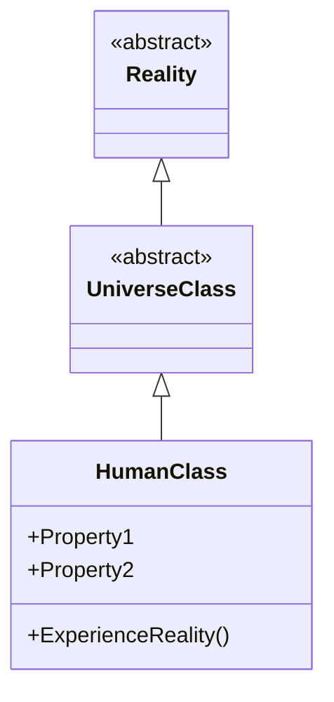

import { Callout, Steps, Step } from "nextra-theme-docs";

# Inheritance and Subclasses

Just as objects in object-oriented programming inherit properties and behaviors from their parent classes, the speakers suggest that the "human class" itself may inherit from higher-level abstractions or "parent classes" within the broader metaphysical system or "program" underlying reality.

This concept implies a hierarchical structure, where the "human class" could be considered a subclass or instantiation of even more fundamental classes or constructs governing existence. These higher-level classes likely define the most foundational properties and rules that shape the human experience and reality as we know it.

<Callout emoji="💡">
The speakers seem to view our perceived three-dimensional universe as merely a "subclass" or subset of a much vaster, potentially higher-dimensional reality governed by these overarching "parent classes" or abstractions.
</Callout>

Consider the following mermaid diagram as a simplified conceptual representation:

In this diagram:

- `Reality` represents the most fundamental, abstract "class" or blueprint defining the core rules and properties of existence itself.
- `UniverseClass` is a subclass of `Reality`, inheriting its properties while specifying additional attributes that shape our perceived universe and the laws of physics governing it.
- `HumanClass` is then a subclass of `UniverseClass`, inheriting the properties and behaviors defined by the higher classes, while additionally including human-specific properties like consciousness, self-awareness, and the ability to experience reality (`ExperienceReality()`).

So from this perspective, humans are just one particular instantiation or "subclass" within a vast hierarchy of classes and abstractions that make up the totality of existence.

<Callout emoji="✅">
The key implication is that by exploring and understanding the "human class" and its properties more deeply (e.g., through psychonautic practices), we may gain insights into the higher-level constructs and code that underpin our reality.
</Callout>

This concept of inheritance and subclasses ties into other analogies the speakers use, such as:

- Humans as "class instances" instantiated from the "human class" definition, inheriting its attributes.
- "Filling properties" refers to the process of realizing and manifesting the various properties defined for the human class through our experiences and growth.

For example, qualities like self-awareness, creativity, and the ability to ponder existential questions could be viewed as "properties" inherited from higher-level classes that define consciousness and the nature of intelligent observers within this metaphysical system.

<Steps>

### Step 1
Understand the hierarchical structure of classes and inheritance in object-oriented programming. Classes can inherit properties and behaviors from parent or base classes.

### Step 2 
Apply this programming concept metaphorically to the nature of reality and human existence. Consider that the "human class" itself may inherit from higher-level abstractions or "parent classes" that define the fundamental rules and properties of our universe and reality.

### Step 3
Visualize this hierarchy, with an ultimate "Reality" class at the top, followed by a "UniverseClass" defining the laws of physics and attributes of our perceived universe, which is then subclassed by the "HumanClass" specifying human-specific properties like consciousness and self-awareness.

### Step 4
Recognize that by deeply exploring and understanding the properties of the "human class" (e.g., through psychonautic practices), we may gain insight into the higher-level "code" and constructs governing our reality.

### Step 5
Connect this metaphor to other programming analogies used by the speakers, such as humans as "class instances," "filling properties" through experiences, and the process of instantiating and realizing the attributes defined for the human class.

</Steps>

The key takeaway is that through a programming metaphor, the speakers suggest a hierarchical, nested structure to reality, with the human experience being just one particular manifestation or "subclass" within a vast, overarching metaphysical system or "program." By exploring the depths of human consciousness and perception, we may uncover clues about the higher-level abstractions and rules that shape our reality.