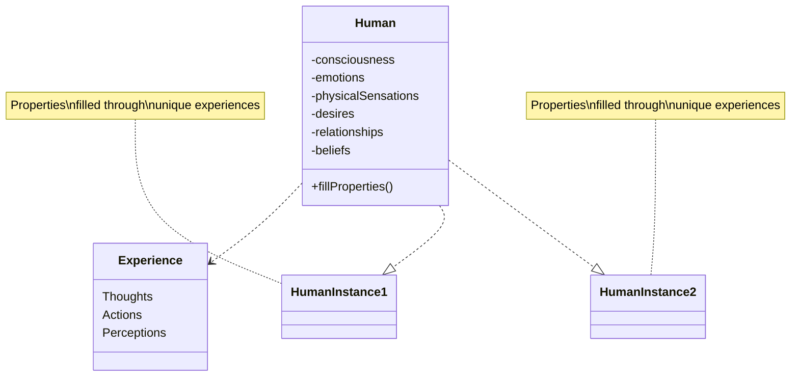

import { Callout, Steps, Step } from "nextra-theme-docs";

# Properties and Filling Properties

When discussing the concept of humans as instances of a "class" within the larger "reality program," the speakers frequently refer to "properties" and the process of "filling properties." But what exactly do they mean by this?

**Properties** in this context can be understood as the attributes, characteristics, and experiences that define our existence as human beings. Just as a class in object-oriented programming has properties that specify the behavior and state of its instances, the "human class" is seen as having a set of properties that govern various aspects of the human experience.

Some examples of properties discussed by the speakers include:

- Consciousness and awareness
- Emotions and feelings
- Physical sensations and perceptions
- Desires and aspirations
- Relationships and social interactions
- Beliefs and worldviews

These properties can be thought of as the "code" or blueprint that shapes our reality as humans. However, the speakers suggest that we don't merely inherit these properties passively, but rather actively engage in a process of **"filling properties"** through our thoughts, actions, and lived experiences.

<Callout emoji="💡">
The act of "filling properties" refers to the realization and instantiation of the various attributes and experiences defined for the human class. It's the process of manifesting the potential encoded within our metaphysical blueprint.
</Callout>

For example, the property of "consciousness" is an inherent aspect of the human class, but the specific content and quality of our consciousness is something we actively "fill" through our engagement with the world around us. Our conscious experiences, from the most mundane to the most profound, can be seen as instantiations of this core property.

Similarly, the property of "emotions" is a fundamental part of the human experience, but the specific emotions we feel – joy, sadness, anger, love – are unique instances of that property that we "fill" through our interactions and lived experiences.

The speakers suggest that by exploring altered states of consciousness, such as those induced by psychedelics or meditation, we can access and "fill" properties of human existence that may typically go untapped or underutilized in ordinary waking consciousness.

<Steps>

### Step 1: Identify Unfilled Properties

The first step in "filling properties" is to identify areas of human experience or potential that we have yet to fully realize or actualize. This could involve introspection, self-inquiry, or simply being open to new perspectives and experiences.

### Step 2: Engage in Property-Filling Activities

Once we've identified properties we wish to "fill," we can engage in activities and practices that facilitate the realization of those properties. This might involve:

- **Psychedelic or entheogenic journeys** to access expanded states of consciousness and perception
- **Meditation and contemplative practices** to cultivate awareness, presence, and insight
- **Creative pursuits** to tap into our imaginative and expressive capacities
- **Physical and sensory exploration** to deepen our embodied experiences
- **Relational and social engagement** to explore the properties of human connection and community

### Step 3: Integrate and Iterate

The process of "filling properties" is iterative and ongoing. As we realize certain properties through our experiences, we may uncover new layers or dimensions of those properties, prompting further cycles of exploration and integration.

</Steps>

By actively "filling properties," the speakers suggest, we not only deepen our individual human experience but also gain insight into the nature of the larger "reality program" of which we are a part. Each property we actualize provides a window into the underlying mechanics and dynamics of existence itself.

[Here's an example mermaid diagram](/humans-as-a-class) illustrating the concept of humans as instances of the "human class," with properties being filled through our experiences:

In this diagram, the `Human` class has various properties defined, such as `consciousness`, `emotions`, and `physicalSensations`. Each individual human instance (`HumanInstance1` and `HumanInstance2`) inherits these properties from the `Human` class but "fills" them through their unique lived `Experience`s, composed of `Thoughts`, `Actions`, and `Perceptions`.

The process of "filling properties" is not only a means of deepening our individual human experience but also a way of exploring and understanding the very nature of the "reality program" itself. By actualizing the full breadth of our inherent properties, we gain insight into the mechanics and dynamics that underlie existence – a glimpse into the profound simplicity at the heart of the seemingly complex construct we inhabit.