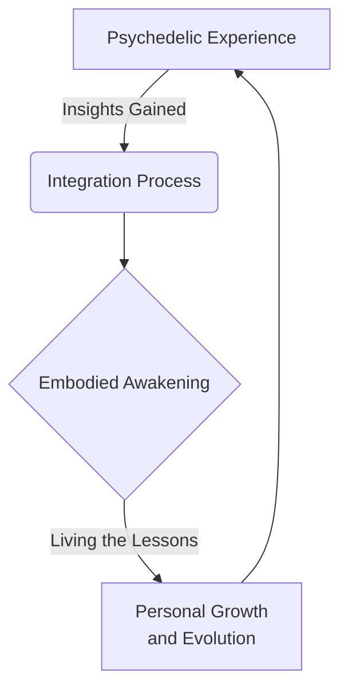

import { Callout, Steps, Step } from "nextra-theme-docs";

# Integration and Grounding

Psychedelic experiences can be profoundly transformative, but to fully embody and integrate the insights gained, a process of grounding and anchoring those experiences into everyday life is crucial. Simply having a mind-blowing trip is not enough - the real work begins when you return to consensus reality.

<Callout>
The insights and perspectives gained through psychedelic journeys hold immense potential for personal growth and expanded awareness. However, without proper integration, these can remain as fleeting glimpses rather than becoming enduring shifts in consciousness.
</Callout>

To ground and integrate the lessons from psychedelic realms:

<Steps>

### Step 1
Allow for adequate time and space to process the experience. Journaling, creative expression, and dialoguing with others who have tread similar paths can aid in unpacking and making sense of the visions and feelings encountered.

### Step 2 
Be mindful of not getting caught in "psychedelic elitism" or dismissing ordinary reality as an illusion. The extraordinary states accessed through psychedelics exist within the same metaphysical framework as everyday waking consciousness. The goal is to bring lessons and expanded perspectives back into daily life, not reject it entirely.

### Step 3
Identify practical ways to embody and live out the realizations gained. This could involve shifts in lifestyle, relationships, creative or spiritual practices. Bridging the gap between transcendent insights and grounded actions is key.

</Steps>

Psychedelic explorer [Terence McKenna](/psychedelics-and-plant-medicines/altered-states-of-consciousness) eloquently expressed the need to "taste theMenuG" of the extraordinary states, but then return to the "heavy dance of being" in ordinary reality. Striking this balance allows the seeds planted by psychedelic experiences to take root and blossom in a grounded, integrated way.

Consider the metaphor of a tree: The branches reaching skyward symbolize the transcendent exploration of consciousness, but the roots anchoring the tree in soil and drawing nourishment represent the integration process. Both elements are vital for healthy, sustainable growth and evolution.

<Callout>
$$\Large\frac{\text{Transcendent Insight}}{\text{Embodied Integration}} = \text{Holistic Growth}$$
The journey doesn't end with the psychedelic experience itself - it's an ongoing cycle of expansion and grounding, transcendence and integration, that allows us to fully metabolize the gifts of these sacred medicines.
</Callout>

Ultimately, the goal is not to constantly chase heightened psychedelic states, but to **become** the living embodiment of expanded awareness - bringing that presence of awakening into each moment without needing external catalysts. With patience, commitment, and an open heart, the integration journey leads to a harmonious dance of the ordinary and non-ordinary.

