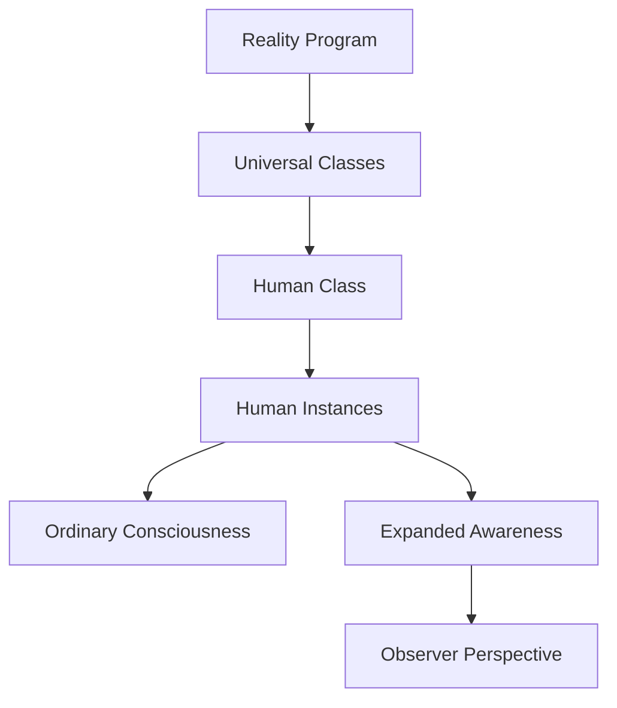

import { Callout, Steps, Step } from "nextra-theme-docs";

# Coding Analogies for Simplicity

The speakers frequently employ coding and programming analogies to articulate their philosophical perspective on the nature of reality. While these metaphors may initially seem complex, they are ultimately attempts to simplify and distill profound metaphysical ideas into a more graspable framework.

One of the core analogies is the notion of humans as "class instances" inheriting properties and behaviors from a higher-level "human class" definition. Just as an object in programming is an instantiation of a class blueprint, we are seen as individual manifestations of a more fundamental human blueprint or template.

<Callout>
Reality itself is likened to a vast "program" or "construct" in which the human class operates. Our thoughts, feelings, and experiences are akin to the instantiation and execution of properties defined within this program's source code.
</Callout>

The speakers suggest that ordinary human consciousness is confined to and shaped by the "human construct" - the limited set of properties and parameters specified for the human class instance. To transcend this limited perspective and perceive the bigger picture, one must undergo "ego dissolution" and activate the "observer property."

Having the "observer property" set to true is compared to stepping outside of the human instance and witnessing the larger metaphysical system from a detached, universal vantage point. This state of awareness allows one to recognize humans as relatively insignificant pieces executing within a grander metaphysical "program" - a mere subset of the totality of existence.

<Callout emoji="⚠️">
A key implication is that despite our perceived primacy, human understanding and agency is inherently limited by the parameters defined for our class within the broader reality program. We are simultaneously executing the program and confined by its rules.
</Callout>

While these coding analogies may seem abstract, the speakersPosition them as a means of stripping away the complexity we often ascribe to the fundamental nature of existence. The genius, they suggest, lies in finding "resources in simplicity" rather than getting mired in philosophical convolutions.

For example, reframing reality as an information system or computational process ditches assumptions of pure materialism. Instead, the entirety of existence could be an unfolding of a deeper, more primary "source code" - an underlying rules engine where our time, Space, and elements of experience are akin to variables, functions, and output.

<Steps>

### Step 1
Shed assumptions of materialism and embrace an information metaphysics view of reality.

### Step 2 
Frame existence itself as an execution of fundamental source code or rules engine.

Matter/energy, space/time are variables, elements emergent from this program.

### Step 3
Let mathematical laws, symmetries, deeper organize principles point toward the structure and logic of this Reality OS.

### Step 4
Use computational metaphors to understand and explore the nature of consciousness beyond just neurons.

</Steps>

So while couched in programming jargon, the speakers' use of coding analogies serves to articulate a radically simple notion: that reality as we know it arises from the instantiation of a more primary, transcendent informational source - a Universal program outside our ordinary comprehension.

[Go to Finding Resources in Simplicity](/resources-in-simplicity)