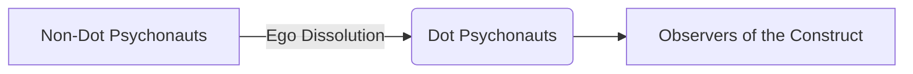

import { Callout, Steps, Step } from "nextra-theme-docs";

# Dot Psychonauts vs Non-Dot Psychonauts

In our exploration of transcending the ego construct, we come across a key distinction between what the speakers refer to as "dot psychonauts" and "non-dot psychonauts." This demarcation represents the fundamental difference in awareness and perception between those who have undergone [ego dissolution](/transcending-the-ego) and those still trapped within the confines of the human "construct."

<Callout>
As a refresher, ego dissolution refers to the temporary dissolution of one's sense of self or ego, leading to a merging of boundaries between the self and the environment/universe. This state is often facilitated by [psychedelics and plant medicines](/psychedelics-and-plant-medicines), and is seen as a gateway to perceiving reality beyond the limitations of ordinary consciousness.
</Callout>

## Dot Psychonauts: The Observers

Dot psychonauts are those who have successfully set their "observer property" to true. In other words, they have achieved a state of detached, universal awareness that allows them to perceive reality from a vantage point outside the conventional "human construct."

To use a coding analogy, dot psychonauts are akin to observers watching the execution of a program, rather than being caught up in the program themselves. They can witness the unfolding of the "reality program" without being blinded by the limited perspectives and attachments that plague non-dot psychonauts.

Some key characteristics of dot psychonauts include:

- A deep understanding that their individual identity is ultimately an insignificant construct within a larger metaphysical system
- The ability to perceive reality from a simple, distilled essence, unencumbered by complexity
- A recognition that language and human constructs often fail to fully capture the nature of existence they have glimpsed

## Non-Dot Psychonauts: Trapped in the Construct

In contrast, non-dot psychonauts are those who have yet to achieve ego dissolution and remain trapped within the confines of the "human construct." They are akin to code executing within the program, lacking the external perspective of the observers.

Some key characteristics of non-dot psychonauts include:

- A fixation on the superficial "properties" of human experience, without grasping the bigger metaphysical picture
- An attachment to the ego and conventional notions of self, identity, and reality
- A tendency to seek understanding through complexity rather than simplicity

<Callout>
It's important to note that this distinction between dot and non-dot psychonauts is not meant to be a value judgment or a source of elitism. Rather, it reflects the speakers' perspective on the varying degrees of awareness and understanding that individuals may possess based on their experiences and insights.
</Callout>

The ultimate goal, as expressed by the speakers, is to attract more individuals who can grasp and build upon their philosophical framework. By creating platforms and mediums for engagement, such as the proposed [dot psychonaut platform](/attracting-fellow-psychonauts/dot-psychonaut-platform), they hope to facilitate the transition from non-dot to dot psychonaut for those who are ready to transcend the ego construct.