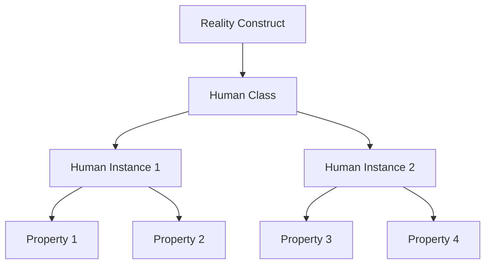

import { Callout, Steps, Step } from "nextra-theme-docs";

# The Observer Property

The "observer property" is a key concept in the philosophy of the psychonauts. It refers to the ability to perceive and observe reality from a detached, elevated vantage point - outside of the limited "human construct." Setting this "observer" property to "true" is likened to achieving a state of awareness and perspective where one can view humans as insignificant pieces in a larger system, akin to an observer watching a program execute.

<Callout>
Achieving the observer property allows you to transcend the ego and conventional notions of identity/self that blind most people to the true nature of existence as a "program" or "construct."
</Callout>

When the observer property is set to "true," you gain access to a more universal perspective, unencumbered by the constraints of the human experience. From this vantage point, the intricate patterns and underlying mechanics of the reality "program" become more apparent, revealing the interconnected nature of all things.

<Steps>

### Step 1: Ego Dissolution

To activate the observer property, one must first undergo a process of "ego dissolution." This involves temporarily shedding the sense of self or ego, allowing the boundaries between self and environment/universe to dissolve. Psychedelics and plant medicines are often used as catalysts to facilitate this ego dissolution, inducing [altered states of consciousness](/psychedelics-and-plant-medicines/altered-states-of-consciousness) that provide glimpses into the larger metaphysical construct.

### Step 2: Detached Awareness

With the ego dissolved, you can step back and observe the human experience from a detached, non-dualistic perspective. The self is no longer the central reference point, and you become aware of the vast interconnected system in which we exist.

$$
\text{Observer Property} = \begin{cases}
\text{True} &\text{if Ego Dissolved}\\
\text{False} &\text{otherwise}
\end{cases}
$$

### Step 3: Perceiving the Construct

From this observer state, the true nature of reality as a "construct" or "program" becomes more apparent. You can perceive the intricate interplay of "properties" and "instances," much like objects and classes in a software program, interacting and executing according to underlying rules and mechanics.

</Steps>

Having the observer property set to "true" allows you to see past the illusion of separateness and recognize the interconnected nature of all things within the reality construct. It provides a more holistic, universal perspective, free from the limitations of the ego and conventional human constructs.

<Callout>
While this detached observer state can be profound, it's important to maintain a grounded perspective and integrate these insights into everyday life, rather than becoming entirely dissociated from the human experience.
</Callout>

Ultimately, the observer property represents a heightened state of awareness and perception, allowing you to navigate the reality construct with a deeper understanding of its underlying mechanics and your place within it.